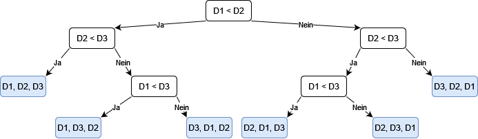

# 2
* a) Zeichnen Sie einen vollständigen Entscheidungsbaum für n = 3 Datenelemente auf.
  [D1, D2, D3] wäre dann die sortierte Folge

  


* b) Für einen Binärbaum mit B Blättern gilt bekanntlich h ≥ log2(B)+1. Stimmt dies für Ihren aufgezeichneten
  Entscheidungsbaum?

  h >= (log2(6)+1 = 3.58496) -> h = 4


* c) Wie viele Vergleiche sind also mindestens notwendig, um jeden der n! möglichen Ausgangssituationen differenzieren
  zu können?

  C >= (h - 1 = 4 - 1 = 3 || log2(6) = 2.58496) -> C = 3


# 3
* a) Angenommen, Ihnen steht ein super Sortieralgorithmus mit einer Laufzeitkomplexität von
  O(g(n)) zur Verfügung. Der Algorithmus ist aber leider instabil! Wie liesse sich erreichen,
  dass schlussendlich trotzdem ein stabiles Sortierergebnis vorliegt? Dokumentieren Sie die
  Modifikationen gut nachvollziehbar (vgl. Pseudocode, Beispiel, Grafik, Prosa).
```
list = getData()
sortedList = providedSorter.sort(list)
equalElementsByIndex = new Map()
for i = 0;i<sortedList.size();: // 0(n)
  // collect potentialy unstable elements
  element = sortedList.get(i)
  equalElements = [element]
  j = 1
  while element.compareTo(sortedList.get(i+j)) == 0:
    equalElements += sortedList.get(i+j)
    j++
  if not equalElements.size() > 1:
    equalElementsByIndex.put(i, equalElements)
  i += j // skip already checked elements or + 1
for element in list: // + O(n)
  for key,value in equalElementsByIndex: // * O(n/2)
    if value.contains(element): // contains by reference + O(n)
      sortedList.set(key, element) // O(1) with index
      value.remove(element) // theoreticly if contains return index O(1)
      equalElementsByIndex.remove(key) // + 0(n/2)
      if not value.isEmpty():
        equalElementsByIndex.put(key+1, value)
        
O(n+(n*(n/2 + n/2))) = O(n + n^2) = O(n^2) || O(n+(n*(n/2 + n))) // jajo eg höre mol uf
```

  