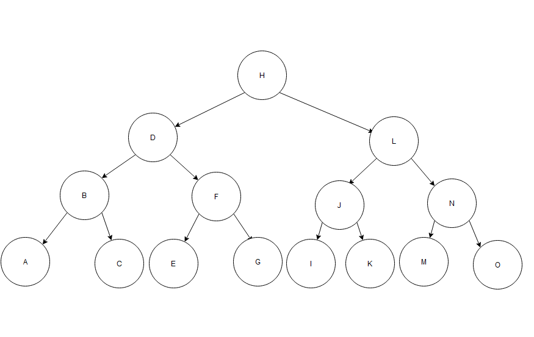
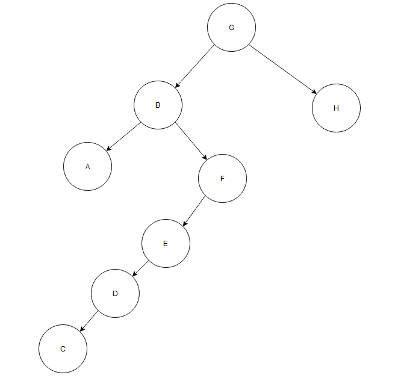
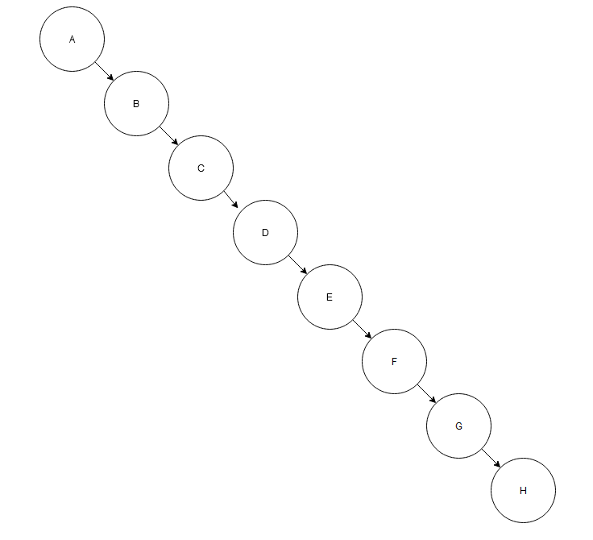

# 1
* a) a
* b) e, e, g, c, k, i
* c) b3, d2, h1, j1
* d) Niveau 1
* e) 1 (ohne Blätter)
* f) adhj -> 3
* g) 5
* h) Die Ordnung ist mindestens 3
* i) Nein, alle 3 Teilbäume habe unterschiedliche Höhen (mehr als 1 unterschied)

# 2
* a) 1
* b) 2
* c) 4 (inkl. 0), (2^(n+1))-1=k, n=log2(k+1)-1
* d) 30 (inkl. 0), k-1=n
* e) k=2^n (nur niveau), (2^(n+1))-1=k (ganzer Baum)
* f) nein -> n=log2(k+1)-1 = ~1.58
* g) nicht ausgeglichen: O(n) // ausgeglichen: O(log2(n))

# 3
* a) 3,  Vollständig oder komplett
* b) 
* c) HLN, HLJK, HLNO
* d) 
* e) SingleLinkedList

* f) Inorder
* g) 
```
 inorder(Knoten k) {
    if (k != null) {
        inorder(k.left)
        handle(k)
        inorder(k.right)
    }
 }
 inorder(wurzel)
```
